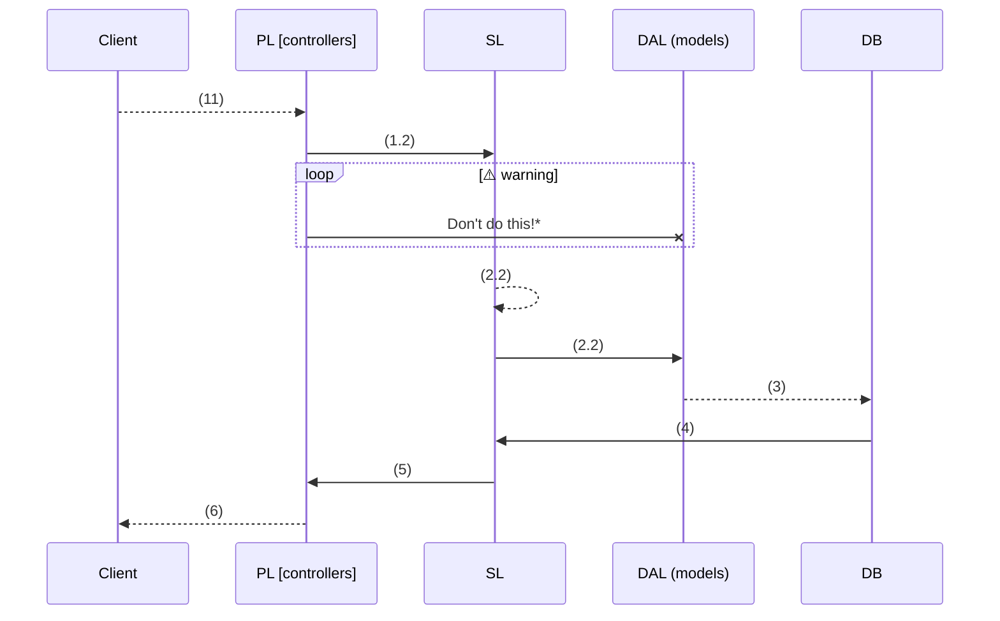
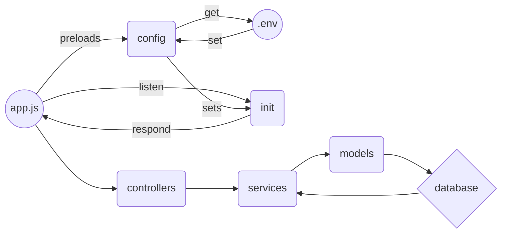

# Project history

Hi, O. Oda! This is my first ever production grade(ish~) nodejs application. I hail from the depths of the low level programming world. Let's talk about problems of spaghetti code in nodejs, shall we?
Diving head first on creating a "basic" nodejs app, I stumble upon tutorials that are unacceptable on the other end of the language spectrum.

## Project scalability and maintenance hell

Have you ever had problems when clients requests for changes? Me, too. Adding, modifying and removing existing features of your project almost always finds a way to lead us to the path of spaghetti code. I like my spaghetti as food, but not as a software.

Traditionally we directly process client request to models and worst to database as raw request. Doing so exposes your system to problems from maintenance to security. Using controllers to store the business logic destroys the concept of reusability and separation of concern! (*see **understanding ArchPattern** section below*) So adding, modifying and removing codes eventually becomes tangled that is both hard to scale and maintain. Your structured initial design will become a mess in no time.

Aside from problems in development, as  soon as you need to write unit tests, you will end up dealing with complex mocks for _req_ or _res_ express.js objects adding another layer of unnecessary complications to your software.
> **Pro's Note:** I'm not a pro, yet! Let's hope we all get there.
> 
# ArchPattern

ArchPattern encompasses great architecture standard from other languages I've used. This app willl enable you to grow your project while ensuring readability, testability, and maintainability (hopefully).


# Folder structure

ArchPattern uses a clean folder structure that is easy to maintain, understand and follow. Below is a quick overview:
```
src
└───api             # Express route controllers for all the endpoints of the app
  └───middlewares   # Operations that checks (whitelist and filter) or maniuplates request
  └───routes        # Routes in table of contents format
  └───index.js      # Initialize middlewares and routes for easier call stack
└───config          # Environment variables and configuration related stuff
└───engine          # Startup processes (under the hood workers)
└───interfaces      # Global namespace
└───jobs            # Jobs definitions for agenda.js
└───models          # Database models
└───services        # Encapsulates all business logic
└───subscribers     # Event handlers for async tasks
└───app.js          # Application entry point
```	

> **Note:** for a complete ***middleware list***, follow this [link](https://expressjs.com/en/resources/middleware.html).

> **Pro Tip:** For added security and performace, sanitize, whitelist and filter raw request (lodash#pick)[link](https://lodash.com/docs/4.17.4#pick).


## Architecture Philosophy

Listed below are software **development concepts** and **design philosophy** that guides this architecture:

 - the [KISS principle](https://en.wikipedia.org/wiki/KISS_principle) (minimum viable product)
 - make the pillars of your software [SOLID](https://en.wikipedia.org/wiki/SOLID)
 - Abstraction and Encapsulation 
 - [Separation of Concerns](https://medium.com/machine-words/separation-of-concerns-1d735b703a60)
 - using [Test Driven Development (TDD)](https://www.guru99.com/test-driven-development.html) approach
 - Strictly follows [Patterns of Enterprise Application Architecture (PoEAA)](https://martinfowler.com/eaaCatalog/)

## Understanding ArchPattern

### Part1: (request, response, next) =>
ArchPattern uses 3 layer architecture (*see [Separation of Concerns](https://medium.com/machine-words/separation-of-concerns-1d735b703a60)*) and flows like this:
1.  Requests send by Client(s):
    1.1.  Presentation Layer (*PL*) **`[controllers`**`, see folder structure]` **receive incoming client requests**
    1.2. PL **handles requests** (sanitize and format requests, etc.) **and send to `services`** `[services, see folder structure]`
2. Service Layer *(SL*):
    2.1.  **Contains and process all business logic**
    2.2. **Function calls to the data access `layer`**
3.  The data access layer (DAL) **interacts with the database** via queries (*preferably using `connection pools` in `async await` manner?*)
4.  **Results are passed back to the service layer where data are processed**
5.  **The Service layer hands processed data to the Presentation Layer**
6.  The PL (format request, etc.) **sends response to the client!**


**controller functions passing client request directly to DAL
   (a) may cause security flaws if not processed properly
   (b) one of the leading reason for spaghetti code*

### Part 2: Process stack
It's hard to explain, don't ask me hahaha. I'm doing this in the middle of the night.. so.... yeah. Just refer to Folder structure and you'll be fine.

